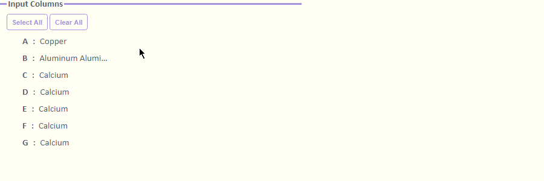
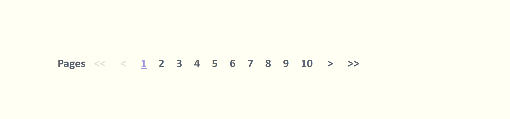
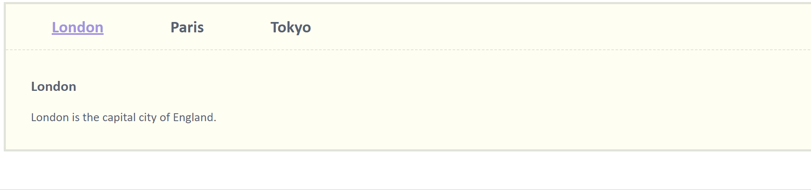

## Vue.js Components Used in Origin Apps

### Introduction
Vue.js components allow us to split the HTML dialog into independent and reusable pieces, but Vue provides few built-in components that cannot cover various UI designs. Although we can introduce other MIT-licensed UI component frameworks into apps, this will also increase the file size. It seems unacceptable that we use only one component but end up with a large-size opx file.

In general, we have to implement our own component model that allows us to encapsulate custom content and logic, but luckily we can reuse these components in different Apps.

I am collecting some commonly used components that I created. Hope this can help us to build HTML dialog for apps easily.

### Components
| Component | Used in App | Demo |
| --- | --- | --- |
|[Drag and Drop Text Box](./demo/Drag%20and%20Drop%20Text%20Box) | 3D Windrose App, Graph Maker App |  |
|[Multi-Select](./demo/Multi-Select) | Correlation Plot App| |
| [Sortable and Searchable Tables](./demo/Sortable%20and%20Searchable%20Tables) | X-Ray Diffraction Analysis App, Extract Graph Data App| |
| [Textbox with Dropdown](./demo/Textbox%20with%20Dropdown) | Common Bar Width App| |
| [Pagination](./demo/Pagination) | Matrix Analysis App|  |
| [Tabs](./demo/Tabs) | Matrix Analysis App|   |
| [Dropdown Menu](./demo/Dropdown%20Menu) | NMR Tools App|  |

### How to Use
#### 1. Defining a Component
We can define a vue component as a plain javascript object, like:

```js
<script type="text/x-template" id="navbar-template">
…
</script>

<script>
Vue.component("navbar", {
template: "#navbar-template",
…
});
</script>
```

#### 2. Decorating a Component
Use CSS to decorate a component:

```html
<style>
/* Navbar */
	…
/* END Navbar */
</style>
```

#### 3. Using a Component
Components can be reused as many times as you want in the DOM:

```html
<navbar></navbar>
```

To render the component on our dialog, we need to pass data to a custom attribute:

```html
<navbar :menu="menu_data" :selected_menu="selected_menu"></navbar>
```
Also, some features of the component may require communicating back up to the dialog. We can use v-on or @ to listen to any event on the component instance:
```html
<navbar :menu="menu_data" 
    :selected_menu="selected_menu"
    @update_selected_menu="onSelectMenu">
</navbar>
```

